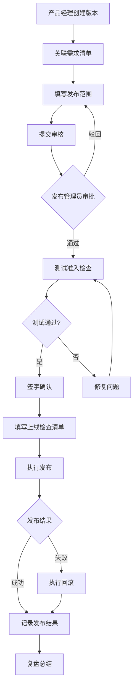
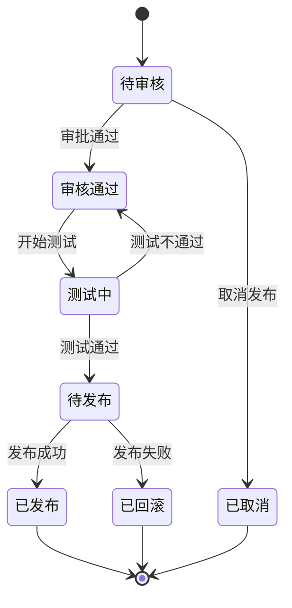

## 1. 产品概述

发布管理平台是一款面向产品、测试和研发团队的协作工具，用于统一管理版本上线全流程。平台提供版本规划、发布单管理、需求关联、测试准入检查、上线检查清单和发布记录追溯等核心功能，帮助团队规范化发布流程、降低上线风险、提升协作效率。

**目标用户**：产品经理、测试工程师、研发工程师、发布管理员

**核心价值**：实现发布流程可视化、风险可控、责任可追溯

---

## 2. 核心功能

### 2.1 用户角色

| 角色 | 权限说明 |
|------|----------|
| 产品经理 | 创建版本、关联需求、填写发布范围、查看发布记录 |
| 测试工程师 | 维护测试准入、填写用例通过率、缺陷统计、签字确认 |
| 研发工程师 | 维护影响系统、填写回滚方案、上传附件、执行上线 |
| 发布管理员 | 审批发布单、标记风险、状态流转、复盘总结 |

### 2.2 功能模块

1. **版本日历**：按周/月视图展示版本计划，检测时间冲突
2. **发布单**：创建版本、状态流转、审批意见、风险标记、回滚方案、附件上传
3. **需求清单**：关联需求、需求状态、优先级管理
4. **测试准入**：用例通过率、遗留缺陷、阻塞项、签字确认
5. **上线检查**：配置检查、通知确认、数据备份、灰度安排逐项勾选
6. **发布记录**：时间线、参与人、结果、复盘结论

### 2.3 页面详情

| 页面名称 | 模块名称 | 功能描述 |
|----------|----------|----------|
| 版本日历 | 日历视图 | 支持周视图/月视图切换，展示所有计划发布版本 |
| 版本日历 | 冲突检测 | 自动检测同一时间段内的版本冲突并高亮提示 |
| 版本日历 | 版本卡片 | 显示版本名称、状态、负责人、计划时间 |
| 发布单 | 基本信息 | 版本号、发布类型、计划时间、实际时间、负责人 |
| 发布单 | 状态流转 | 待审核→审核通过→测试中→待发布→已发布→已回滚 |
| 发布单 | 发布范围 | 版本描述、影响系统、涉及模块、变更内容 |
| 发布单 | 审批区域 | 审批意见、审批人、审批时间、审批状态 |
| 发布单 | 风险管理 | 风险等级标记、风险描述、应对措施 |
| 发布单 | 回滚方案 | 回滚步骤、回滚脚本、回滚验证方法 |
| 发布单 | 附件管理 | 支持上传部署包、配置文件、测试报告等附件 |
| 需求清单 | 需求列表 | 展示关联需求，支持筛选、排序、搜索 |
| 需求清单 | 需求详情 | 需求ID、标题、状态、优先级、负责人 |
| 需求清单 | 关联操作 | 从需求池选择需求关联到版本 |
| 测试准入 | 测试概览 | 测试进度、用例总数、通过数、失败数 |
| 测试准入 | 用例统计 | 用例通过率图表、按模块分布 |
| 测试准入 | 缺陷统计 | 遗留缺陷列表、严重程度、修复状态 |
| 测试准入 | 阻塞项管理 | 阻塞问题列表、责任人、预计解决时间 |
| 测试准入 | 签字确认 | 测试负责人签字确认、确认时间、确认意见 |
| 上线检查 | 检查清单 | 配置检查、通知确认、数据备份、灰度安排四大类 |
| 上线检查 | 逐项勾选 | 每个检查项支持勾选完成、填写备注 |
| 上线检查 | 进度统计 | 已完成/总项数、完成百分比 |
| 发布记录 | 时间线 | 展示发布全过程的关键节点时间线 |
| 发布记录 | 参与人 | 记录所有参与发布的人员及角色 |
| 发布记录 | 发布结果 | 成功/失败/部分成功状态、详细说明 |
| 发布记录 | 复盘结论 | 问题总结、改进建议、经验沉淀 |

---

## 3. 核心流程

### 3.1 发布流程

产品经理创建版本计划 → 关联需求清单 → 填写发布范围和影响系统 → 提交审核 → 发布管理员审批 → 测试工程师执行测试准入检查 → 签字确认 → 研发工程师填写上线检查清单 → 执行发布 → 记录发布结果 → 复盘总结

### 3.2 状态流转

---

## 4. 用户界面设计

### 4.1 设计风格

- **主色调**：深蓝色系（#1E3A5F）作为主色，传达专业、可靠的企业级应用气质
- **辅助色**：橙色（#F97316）作为强调色，用于重要操作和状态提示
- **中性色**：灰色系（#F8FAFC、#E2E8F0、#94A3B8）用于背景和边框
- **状态色**：成功绿（#10B981）、警告黄（#F59E0B）、错误红（#EF4444）、信息蓝（#3B82F6）
- **按钮风格**：圆角矩形（8px），主按钮实色填充，次按钮描边样式
- **字体**：思源黑体 / Noto Sans SC，标题 18-24px，正文 14px，辅助文字 12px
- **布局风格**：左侧固定导航栏 + 右侧内容区，卡片式布局
- **图标风格**：线性图标，2px 描边，与文字等高对齐

### 4.2 页面设计概览

| 页面名称 | 模块名称 | UI 元素 |
|----------|----------|---------|
| 版本日历 | 日历视图 | 周视图/月视图切换按钮，日历网格，版本卡片悬浮效果，冲突高亮红色边框 |
| 发布单 | 基本信息 | 表单布局，输入框、下拉选择、日期选择器，状态徽章 |
| 发布单 | 状态流转 | 横向步骤条，当前步骤高亮，已完成步骤打勾，点击可跳转 |
| 发布单 | 审批区域 | 卡片式审批记录，审批人头像、姓名、时间、意见，状态图标 |
| 发布单 | 风险管理 | 风险等级下拉（高/中/低），风险描述文本域，颜色编码标签 |
| 发布单 | 附件管理 | 拖拽上传区域，文件列表带图标、大小、删除按钮 |
| 需求清单 | 需求列表 | 表格布局，支持多选，状态筛选器，搜索框，分页器 |
| 测试准入 | 测试概览 | 数据卡片组，环形进度图，数字高亮显示 |
| 测试准入 | 签字确认 | 签名板区域，确认按钮，确认记录展示 |
| 上线检查 | 检查清单 | 分组折叠面板，复选框列表，进度条，完成百分比 |
| 发布记录 | 时间线 | 垂直时间线，节点图标，时间戳，内容卡片，参与人标签 |

### 4.3 响应式设计

- **桌面优先**：主要面向办公场景，优先保证 1440px 及以上宽度最佳体验
- **平板适配**：1280px 宽度下，导航栏可折叠为图标模式
- **移动端**：768px 以下，采用单列布局，导航栏变为底部标签栏

### 4.4 交互设计

- **页面加载**：骨架屏占位，数据加载完成后渐显动画
- **状态变更**：Toast 提示成功/失败，状态徽章颜色过渡动画
- **表单提交**：按钮加载状态，禁用重复提交
- **列表操作**：行悬停高亮，操作按钮渐显
- **时间线**：节点依次出现动画，滚动触发