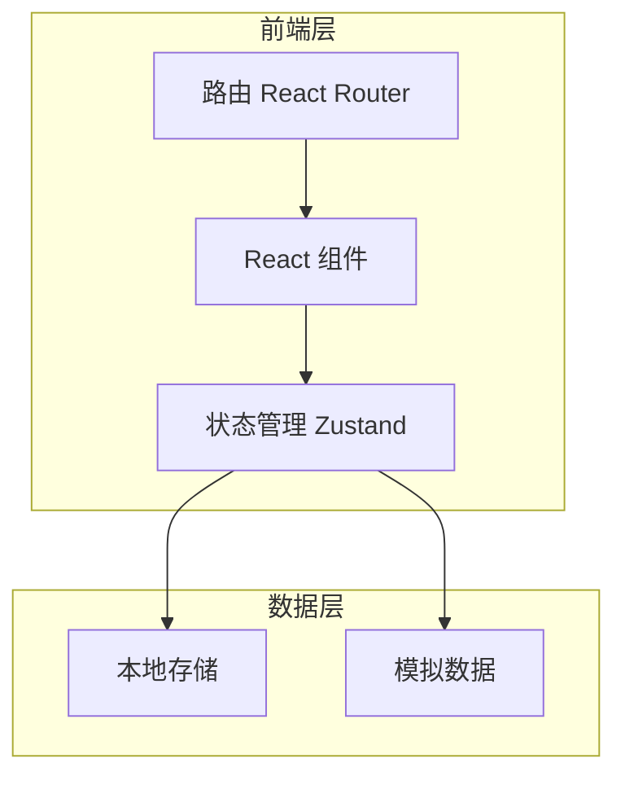
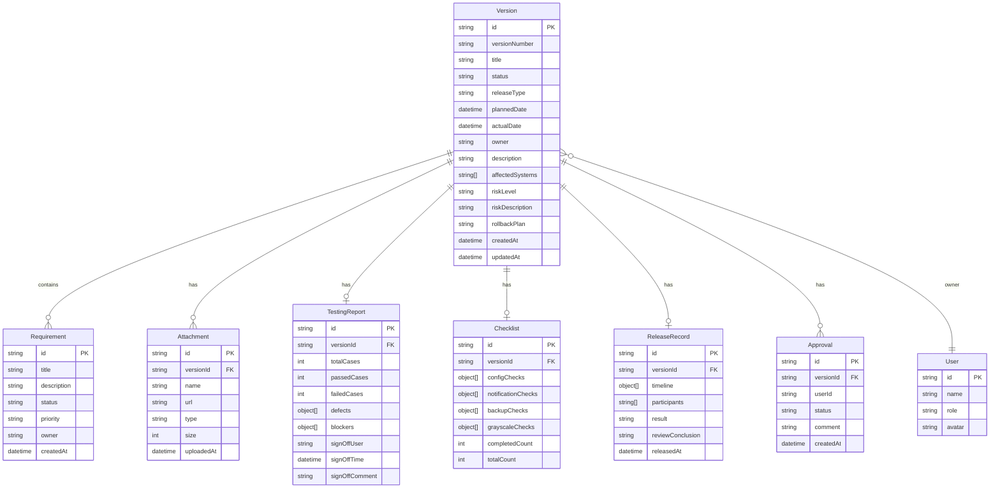

## 1. 架构设计



**架构说明**：
- 采用纯前端架构，数据存储在 LocalStorage，便于演示和快速部署
- 使用模拟数据初始化系统，支持完整的业务流程演示
- 后续可扩展接入后端 API 服务

---

## 2. 技术选型

| 技术栈 | 版本 | 说明 |
|--------|------|------|
| React | 18.x | 核心框架 |
| TypeScript | 5.x | 类型安全 |
| Vite | 5.x | 构建工具 |
| Tailwind CSS | 3.x | 样式框架 |
| Zustand | 4.x | 轻量级状态管理 |
| React Router | 6.x | 路由管理 |
| Lucide React | latest | 图标库 |
| date-fns | 3.x | 日期处理 |
| clsx | 2.x | 类名合并 |

---

## 3. 路由定义

| 路由路径 | 页面名称 | 说明 |
|----------|----------|------|
| `/` | 重定向到 `/calendar` | 默认跳转 |
| `/calendar` | 版本日历 | 日历视图展示版本计划 |
| `/release/:id?` | 发布单 | 创建/编辑发布单 |
| `/requirements` | 需求清单 | 需求关联管理 |
| `/testing/:id` | 测试准入 | 测试准入检查 |
| `/checklist/:id` | 上线检查 | 上线检查清单 |
| `/records` | 发布记录 | 发布历史记录 |

---

## 4. 数据模型

### 4.1 实体关系图



### 4.2 TypeScript 类型定义

```typescript
type VersionStatus = 'pending' | 'approved' | 'testing' | 'ready' | 'released' | 'rolled_back' | 'cancelled';
type ReleaseType = 'major' | 'minor' | 'patch' | 'hotfix';
type RiskLevel = 'high' | 'medium' | 'low';
type ReleaseResult = 'success' | 'failed' | 'partial';

interface Version {
  id: string;
  versionNumber: string;
  title: string;
  status: VersionStatus;
  releaseType: ReleaseType;
  plannedDate: string;
  actualDate?: string;
  owner: string;
  description: string;
  affectedSystems: string[];
  riskLevel: RiskLevel;
  riskDescription?: string;
  rollbackPlan?: string;
  requirementIds: string[];
  createdAt: string;
  updatedAt: string;
}

interface Requirement {
  id: string;
  title: string;
  description: string;
  status: 'pending' | 'developing' | 'testing' | 'done';
  priority: 'p0' | 'p1' | 'p2' | 'p3';
  owner: string;
  createdAt: string;
}

interface TestingReport {
  id: string;
  versionId: string;
  totalCases: number;
  passedCases: number;
  failedCases: number;
  defects: Defect[];
  blockers: Blocker[];
  signOff: {
    user: string;
    time: string;
    comment: string;
  } | null;
}

interface Defect {
  id: string;
  title: string;
  severity: 'critical' | 'major' | 'minor' | 'trivial';
  status: 'open' | 'fixed' | 'wontfix';
  owner: string;
}

interface Blocker {
  id: string;
  title: string;
  description: string;
  owner: string;
  dueDate: string;
  status: 'open' | 'resolved';
}

interface Checklist {
  id: string;
  versionId: string;
  items: ChecklistItem[];
}

interface ChecklistItem {
  id: string;
  category: 'config' | 'notification' | 'backup' | 'grayscale';
  title: string;
  description: string;
  checked: boolean;
  note?: string;
}

interface ReleaseRecord {
  id: string;
  versionId: string;
  timeline: TimelineEvent[];
  participants: string[];
  result: ReleaseResult;
  reviewConclusion?: string;
  releasedAt: string;
}

interface TimelineEvent {
  id: string;
  time: string;
  title: string;
  description: string;
  user: string;
}

interface Attachment {
  id: string;
  versionId: string;
  name: string;
  url: string;
  type: string;
  size: number;
  uploadedAt: string;
}

interface Approval {
  id: string;
  versionId: string;
  user: string;
  status: 'approved' | 'rejected';
  comment: string;
  createdAt: string;
}

interface User {
  id: string;
  name: string;
  role: 'product' | 'test' | 'dev' | 'admin';
  avatar: string;
}
```

---

## 5. 项目目录结构

```
src/
├── components/           # 公共组件
│   ├── Layout/          # 布局组件
│   │   ├── Sidebar.tsx  # 侧边导航
│   │   ├── Header.tsx   # 顶部栏
│   │   └── Layout.tsx   # 布局容器
│   ├── Calendar/        # 日历组件
│   ├── StatusBadge.tsx  # 状态徽章
│   ├── Timeline.tsx     # 时间线组件
│   ├── FileUpload.tsx   # 文件上传
│   └── ...
├── pages/               # 页面组件
│   ├── Calendar/        # 版本日历
│   ├── Release/         # 发布单
│   ├── Requirements/    # 需求清单
│   ├── Testing/         # 测试准入
│   ├── Checklist/       # 上线检查
│   └── Records/         # 发布记录
├── stores/              # 状态管理
│   ├── versionStore.ts  # 版本状态
│   ├── requirementStore.ts
│   └── userStore.ts
├── data/                # 模拟数据
│   ├── mockVersions.ts
│   ├── mockRequirements.ts
│   └── mockUsers.ts
├── hooks/               # 自定义 Hooks
├── utils/               # 工具函数
│   ├── storage.ts       # LocalStorage 操作
│   ├── date.ts          # 日期处理
│   └── id.ts            # ID 生成
├── types/               # 类型定义
│   └── index.ts
├── App.tsx              # 根组件
├── main.tsx             # 入口文件
└── index.css            # 全局样式
```

---

## 6. 状态管理设计

使用 Zustand 进行状态管理，每个 Store 职责单一：

### 6.1 VersionStore

```typescript
interface VersionStore {
  versions: Version[];
  currentVersion: Version | null;
  
  // Actions
  fetchVersions: () => void;
  getVersion: (id: string) => Version | undefined;
  createVersion: (version: Omit<Version, 'id' | 'createdAt' | 'updatedAt'>) => void;
  updateVersion: (id: string, updates: Partial<Version>) => void;
  deleteVersion: (id: string) => void;
  updateStatus: (id: string, status: VersionStatus) => void;
}
```

### 6.2 RequirementStore

```typescript
interface RequirementStore {
  requirements: Requirement[];
  
  fetchRequirements: () => void;
  getRequirement: (id: string) => Requirement | undefined;
  createRequirement: (req: Omit<Requirement, 'id' | 'createdAt'>) => void;
  updateRequirement: (id: string, updates: Partial<Requirement>) => void;
  linkToVersion: (reqId: string, versionId: string) => void;
}
```

---

## 7. 初始化数据

系统启动时自动加载模拟数据，包含：

- **用户数据**：4 个角色用户（产品、测试、研发、管理员）
- **版本数据**：5-8 个不同状态的版本记录
- **需求数据**：15-20 条需求记录
- **测试报告**：对应版本的测试数据
- **检查清单**：标准检查项模板
- **发布记录**：历史发布记录

数据持久化到 LocalStorage，支持用户操作后数据保持。

---

## 8. 关键交互流程

### 8.1 创建发布单流程

1. 点击「新建版本」按钮
2. 填写版本基本信息（版本号、标题、发布类型、计划时间）
3. 选择关联需求（从需求池多选）
4. 填写发布范围（描述、影响系统）
5. 填写风险管理（风险等级、描述、应对措施）
6. 填写回滚方案
7. 上传附件（可选）
8. 提交审核

### 8.2 测试准入流程

1. 从版本列表进入测试准入页
2. 填写/更新测试用例统计
3. 录入遗留缺陷
4. 添加阻塞项
5. 确认测试通过后签字确认

### 8.3 上线检查流程

1. 从版本详情进入上线检查页
2. 逐项勾选检查清单
3. 填写备注说明
4. 所有必选项完成后可执行发布